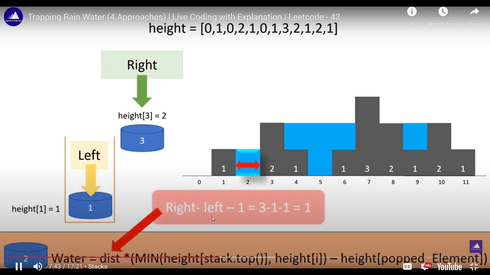

# 42. Trapping Rain Water

**Problem Statement- Input-Output** :\
.png>)

Given an array of heights, we have to obtain the total amount of water stored between these heights.

#### Example:

A =\[4,2,0,3,2,5]\
Output is res = 9

#### Approach

* The concept that a stack is used to find the next greatest is the key.
* The formula for the finding the area of water is : height \* length\
  height = min(Lheight, rHeight)-bot , where LHeight=> stack.peek(), rHeight=>Height\[i], \
  and the bot is the height of the popped element.
* length is the distance and is obtained by i-stack.peek()-1=>right-left-1
* 
* Time Complexity: is O(n) to traverse the array and place them on stack. The insertions and deletions on stack are O(1)
*   **Algorithm** :

    ````java
    java

    ```java
    class Solution {
        public int trap(int[] height) {

            if(height == null || height.length<=2){
                return 0;
            }
            
            //The hint here is to find the next largest element:
            //when that asked think about the monotonic stack which stores the elements in either ascending order or decending order:

            //we need a statck:
            Stack<Integer> stack = new Stack<>();

            //The result:
            int res = 0;
            
            //traverse thru the array and place them in the stack accordingly:
            for(int i=0;i<height.length;i++){

                //while loop to maintain a stack in a decending order
                while(!stack.isEmpty() && height[i] >= height[stack.peek()]){
                    //pop out the bot height which we are handling now:
                    int bot = stack.pop();
                    if(stack.isEmpty()) break;
                    int h = Math.min(height[i],height[stack.peek()]);
                    int l = i-stack.peek()-1;
                    //water area can be found by height*width
                    res += (h-height[bot]) * l;
                }

                //push the element on to the stack:
                stack.push(i);
            }
            return res;
        }
    }
    ```
    ````
